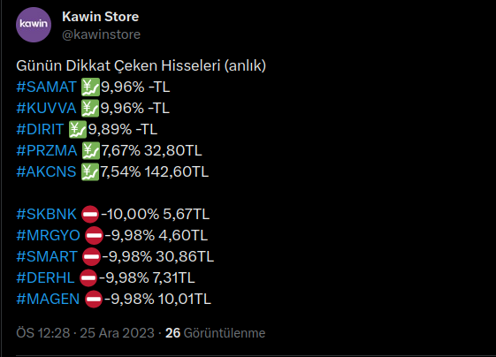

# Twitter Botu - Borsa Güncellemeleri (TR)

Bu Python kodu, Twitter API ve web kazıma (web scraping) kullanarak gerçek zamanlı borsa güncellemelerini Twitter'da paylaşmaya yarar.

## Gereksinimler

Scripti çalıştırmadan önce, Twitter API kimlik bilgilerinizi ayarlamanız gerekiyor. Bir Twitter Geliştirici hesabı oluşturun ve şu kimlik bilgilerini edinin (ücretsiz bir şekilde alabilirsiniz):

- Tüketici Anahtarı (Consumer Key)
- Tüketici Sırrı (Consumer Secret)
- Erişim Anahtarı (Access Token)
- Erişim Anahtarı Sırrı (Access Token Secret)

## Kurulum

1. Depoyu klonlayın:

   ```bash
   git clone https://github.com/Abdulkadirbulbul/borsa-twitter-botu.git
   ```

2. Gerekli Python paketlerini yükleyin:

   ```bash
   pip install requests requests_oauthlib beautifulsoup4
   ```

## Kullanım

Scripti şu komutla çalıştırın:

```bash
python run.py
```
**Yazılım çalıştıkdan sonra terminalde vereceği linke gidip izin verdikten sonraki 6 haneli kodu terminale yapıştırdıkdan sonra sorunsuz çalışacaktır.**

Script, [getmidas.com](https://www.getmidas.com/canli-borsa/) adresinden borsa verilerini sürekli olarak çeker ve Twitter'da güncellemeleri paylaşır. En çok artan ve azalan hisseler arasında geçiş yapar.



## Özelleştirme

Scripti şu değişkenleri düzenleyerek özelleştirebilirsiniz:

Gerekirse kazıma URL'lerini ayarlayın:

```python
bist100 = "https://www.getmidas.com/canli-borsa/xu100-bist-100-hisseleri"
bist30 = "https://www.getmidas.com/canli-borsa/xu030-bist-30-hisseleri"
bist50 = "https://www.getmidas.com/canli-borsa/xu050-bist-50-hisseleri"
```

## Notlar

- Script saatte bir güncelleme yapar (`time.sleep(3600)`).
- Hataları nazikçe ele alır ve istisnalar durumunda çalışmaya devam eder.

Projeye katkıda bulunabilir veya herhangi bir sorunla karşılaşırsanız konu açabilirsiniz.

# # # # # # # # # # # # # # # # # # # # # # # # # # # # #
# Twitter Bot - Stock Market Updates (EN)

This Python code allows you to share real-time stock market updates on Twitter using the Twitter API and web scraping.

## Requirements

Before running the script, you need to set your Twitter API credentials. Create a Twitter Developer account and get these credentials (you can get them for free):

- Consumer Key
- Consumer Secret
- Access Token
- Access Token Secret

## Setup

1. Clone the repository:

    ```bash
    git clone https://github.com/Abdulkadirbulbul/borsa-twitter-botu.git
    ```

2. Install the required Python packages:

    ```bash
    pip install requests requests_oauthlib beautifulsoup4
    ```

## Use

Run the script with this command:

```bash
python run.py
```
**After the software runs, go to the link given in the terminal, give permission and paste the next 6-digit code into the terminal, it will work without any problems.**

The script continuously pulls stock market data from [getmidas.com](https://www.getmidas.com/canli-borsa/) and shares updates on Twitter. Switches between the most increasing and decreasing stocks.

## Customize

You can customize the script by editing the following variables:

Adjust scrape URLs if necessary:

```python
bist100 = "https://www.getmidas.com/canli-borsa/xu100-bist-100-hisseleri"
bist30 = "https://www.getmidas.com/canli-borsa/xu030-bist-30-hisseleri"
bist50 = "https://www.getmidas.com/canli-borsa/xu050-bist-50-hisseleri"
```

## Notes

- The script updates every hour (`time.sleep(3600)`).
- Handles errors gracefully and continues working in case of exceptions.

You can contribute to the project or open an issue if you encounter any problems.
